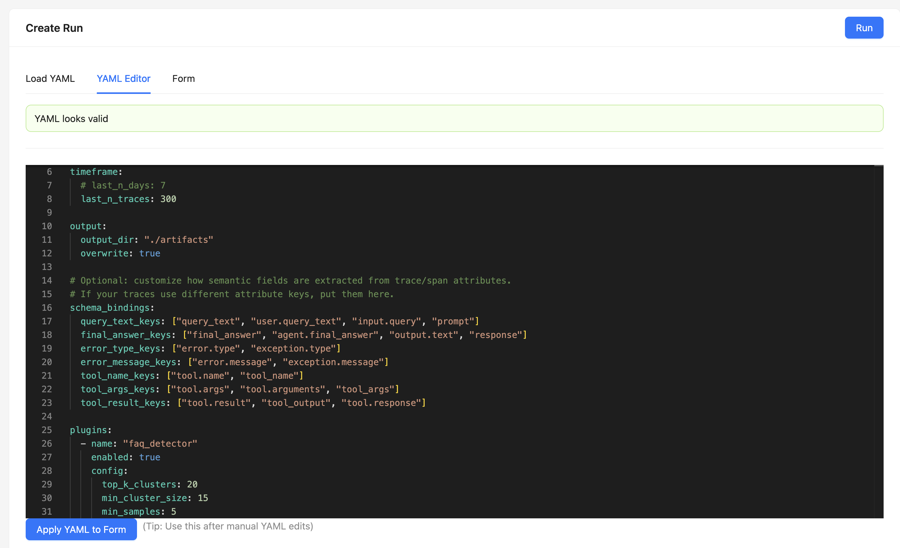
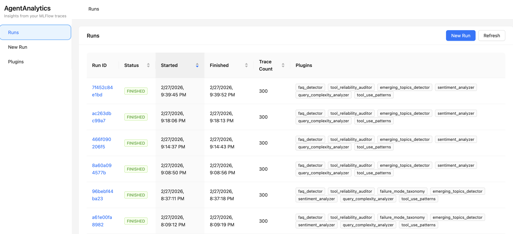
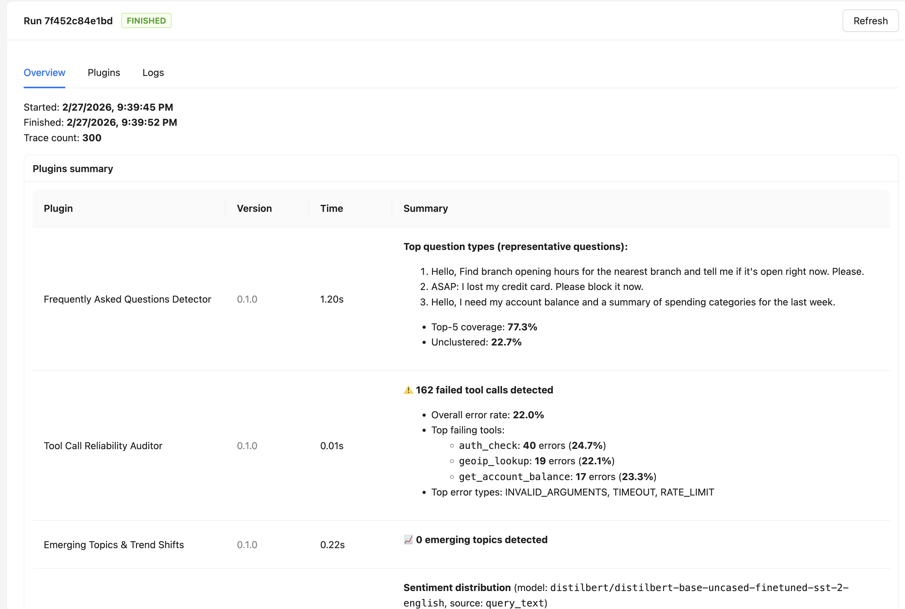
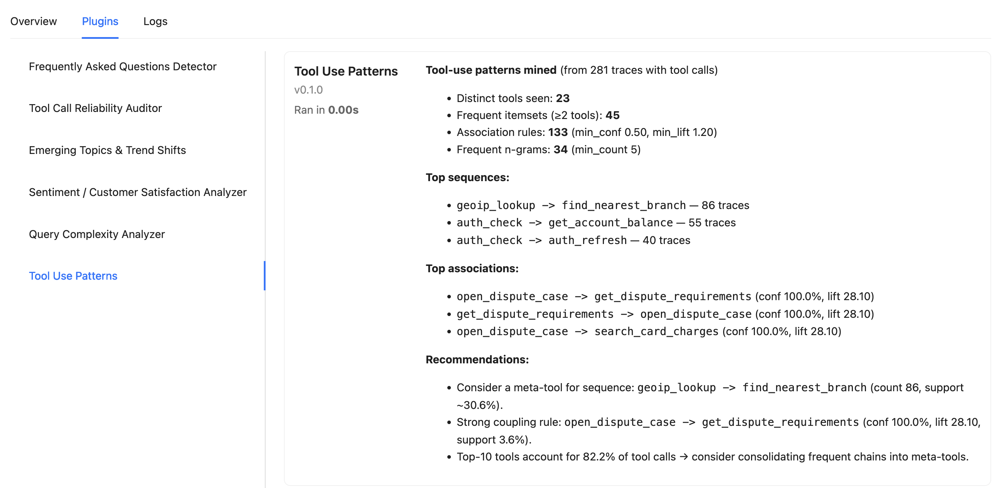

# AgentAnalytics

AgentAnalytics is an analytics framework for agentic AI workflows. It ingests MLflow / OpenTelemetry-style traces, runs a set of modular analytics plugins, and produces actionable artifacts (reports + JSON) through both a CLI and a web UI.

It is designed for teams that already run agentic systems in production and want to mine insights across *workloads*, not just per-request debugging.

---

## What you get

- **CLI** to run analytics on a selected window of traces (last N days/hours, last N traces, etc.).
- **Server** (`agentanalytics-server`) that runs the CLI behind the scenes and exposes a simple REST API.
- **UI** (React + Ant Design, MLflow-like layout) to:
  - Create runs from YAML / Form widgets
  - View runs and per-plugin results
  - View supported plugins and their defaults
  - Tail logs while a run is in progress
- A plugin system where each plugin produces:
  - a human-readable **Markdown report**
  - a machine-readable **JSON artifact**
  - a concise `summary_md` rendered in the UI

---

## Screenshots

### New Run (YAML / Form)


### Runs View


### Run Overview


### Extended Run Report


---

## Quickstart

### 1) Install (dev / editable)

From the repo root:

```bash
pip install -e ".[mlflow,server]"
```

### 2) Start the server

```bash
agentanalytics-server --host 0.0.0.0 --port 8008 --runs-dir ./artifacts/runs
```

API will be available at:

- `http://localhost:8008/api/runs`
- `http://localhost:8008/api/plugins`

### 3) Start the UI

```bash
cd agentanalytics-ui
npm install
npm run dev
```

Open:

- `http://localhost:5173`

### 4) Run your first analysis

Use the UI’s **New Run** page (YAML / Form / Load YAML), or run directly via CLI:

```bash
agentanalytics run -c examples/config.yaml
```

---

## Architecture (high-level)

```
+-------------------+        +------------------------+        +-------------------------+
|   agentanalytics  |        |  agentanalytics-server |        |    agentanalytics-ui    |
|       CLI         |        |     (FastAPI)          |        | (React + Ant Design)    |
|                   |        |                        |        |                         |
|  - reads YAML     | <----- |  - starts CLI runs     | <----- | - creates runs          |
|  - fetches traces |        |  - streams logs (SSE)  |        | - views runs/results    |
|  - runs plugins   |        |  - serves artifacts    |        | - views plugins         |
+-------------------+        +------------------------+        +-------------------------+
              |
              v
       +--------------+
       |   MLflow     |
       | tracing store|
       +--------------+
```

**Storage model:** every analysis run writes a run directory under `./artifacts/runs/<run_id>/` containing `run_manifest.json`, `status.json`, logs, and plugin artifacts.

---

## Data model expectations

AgentAnalytics is flexible and tries to adapt to real-world MLflow trace shapes. It expects traces to contain (directly or through MLflow I/O blobs):

- `query_text` (user request)
- `final_answer` (assistant response)
- `tool_calls` (spans or span metadata indicating tool usage)
- error signals, either as:
  - explicit exception fields, or
  - tool error format: `tool.status="ERROR"` and outputs like `{"tool_result": {"error": "...", "detail": "..."}}`

In many MLflow instrumentations, inputs/outputs are stored as JSON strings in attributes like:

- `mlflow.traceInputs`, `mlflow.traceOutputs`
- `mlflow.spanInputs`, `mlflow.spanOutputs`

AgentAnalytics’ `DefaultTraceView` supports these patterns.

---

## Configuration (YAML)

A typical configuration looks like:

```yaml
mlflow:
  tracking_uri: "http://localhost:5000"
  # optional: search filter string (highly recommended on shared servers)
  query: "tag.aa.scenario = 'banking_demo_v2' AND tag.aa.run = 'abcd1234'"
  # optional: restrict to experiments for stronger isolation
  experiment_ids: ["12345"]

timeframe:
  last_n_days: 7
  # or: last_n_hours: 24
  # or: last_n_traces: 500

output:
  output_dir: "./artifacts"
  overwrite: true

schema_bindings: {}
plugins:
  - name: "faq_detector"
    enabled: true
    config:
      top_k_clusters: 20
      min_cluster_size: 15
      min_samples: 5

  - name: "tool_reliability_auditor"
    enabled: true
    config:
      top_k_tools: 20
      include_examples: true
      max_examples: 5

  - name: "emerging_topics_detector"
    enabled: true
    config:
      top_k_emerging: 15
      min_cluster_size: 12
      min_samples: 3
      min_late_count: 4
      min_growth: 1.4

  - name: "tool_use_patterns"
    enabled: true
    config:
      min_support: 0.03
      max_itemset_size: 4
      min_confidence: 0.5
      min_lift: 1.2
      max_ngram_n: 4
      min_ngram_count: 5

  - name: "sentiment_analyzer"
    enabled: true
    config:
      source: "query_text"
      model_id: "distilbert/distilbert-base-uncased-finetuned-sst-2-english"
      device: "cpu"
      batch_size: 32

  - name: "query_complexity_analyzer"
    enabled: true
    config:
      source: "query_text"
      # currently uses advanced heuristics (feature-driven)
      simple_max: 0.22
      medium_max: 0.50
      complex_max: 0.78
```

### Timeframes

Supported timeframe modes:

- `last_n_days`
- `last_n_hours`
- `last_n_traces`
- optional ISO bounds if your config model supports them (e.g., `start_time_iso`, `end_time_iso`)

---

## Available Plugins

All plugins produce:
- `summary_md` (rendered in UI)
- a Markdown report artifact
- a JSON artifact (structured output)

### FAQ Detector (`faq_detector`)
Clusters queries into common intents and surfaces the most frequent questions and coverage.

### Emerging Topics & Trend Shift Detector (`emerging_topics_detector`)
Finds *new or rapidly growing* query clusters by comparing early vs late traffic within the analysis window.

### Tool Call Reliability Auditor (`tool_reliability_auditor`)
Analyzes tool failures using tool error format (e.g., `tool.status=ERROR`, `tool_result.error`) and reports:
- top failing tools
- top error types
- top tools per error type
- invalid arguments patterns (e.g., `INVALID_ARGUMENTS`)

### Tool Use Patterns (`tool_use_patterns`)
Mines frequent tool **sets** (Apriori) and **sequences** (n-grams) and generates association rules to identify meta-tool opportunities.

### Sentiment / Customer Satisfaction (`sentiment_analyzer`)
Uses a lightweight Hugging Face classifier (not an LLM) to label sentiment and produce distributions and negative themes.

### Query Complexity Analyzer (`query_complexity_analyzer`)
Scores complexity of each query in `[0,1]` and produces bucketed distributions and routing recommendations.

---

## Writing your own plugin

Plugins are the core extension mechanism in AgentAnalytics. A plugin receives a batch of traces, analyzes them, and emits **actionable artifacts** (Markdown + JSON) plus a short **Markdown summary** (`summary_md`) that the UI renders.

### Plugin contract

A plugin is a Python class that implements:

- `name: str` — stable identifier used in YAML and the registry (e.g., `"faq_detector"`)
- `version: str` — version string displayed in the UI
- `analyze(batch: TraceBatch, ctx: PluginContext, config: dict) -> PluginResult`

Where:
- `TraceBatch` is a collection of parsed traces for the selected time window.
- `PluginContext` provides:
  - `output_dir` (where you must write artifacts)
  - `run_id`
  - `view_factory` (to create `TraceView` objects)
  - `resources` (e.g., `embedder`)
  - `limits` (analysis limits, random seed, etc.)
- `PluginResult` includes:
  - `artifacts: List[Artifact]` (paths to files you created)
  - `metrics: List[MetricRecord]` (structured metrics for downstream use)
  - `summary_md: str` (Markdown rendered in the UI Overview + plugin page)
  - optional `annotations: List[TraceAnnotation]` (per-trace labels for future write-back)

### Minimal example plugin

Create a new file under `agentanalytics/plugins/`, for example `agentanalytics/plugins/example_plugin.py`:

```python
from __future__ import annotations

import os, json
from dataclasses import dataclass
from typing import Any, Dict

from agentanalytics.core.plugin import PluginResult, MetricRecord, Artifact
from agentanalytics.core.model import TraceBatch


@dataclass
class ExamplePlugin:
    name: str = "example_plugin"
    version: str = "0.1.0"

    def analyze(self, batch: TraceBatch, ctx, config: Dict[str, Any]) -> PluginResult:
        # 1) Read traces using TraceView (recommended)
        views = [ctx.view_factory.make(t) for t in batch.traces]
        n = len(views)

        # 2) Compute something
        queries = [v.query_text() for v in views if v.query_text()]
        metric = {"traces": n, "queries_with_text": len(queries)}

        # 3) Write artifacts into ctx.output_dir
        os.makedirs(ctx.output_dir, exist_ok=True)

        report_path = os.path.join(ctx.output_dir, "example_report.md")
        with open(report_path, "w", encoding="utf-8") as f:
            f.write("# Example Plugin\\n\\n")
            f.write(f"- Traces: **{n}**\\n")
            f.write(f"- Queries: **{len(queries)}**\\n")

        json_path = os.path.join(ctx.output_dir, "example.json")
        with open(json_path, "w", encoding="utf-8") as f:
            json.dump(metric, f, indent=2)

        # 4) Provide a short UI summary (Markdown)
        summary_md = f"**ExamplePlugin:** {n} traces, {len(queries)} queries with text."

        return PluginResult(
            metrics=[MetricRecord(name="example.summary", data=metric)],
            artifacts=[
                Artifact(kind="markdown", path=report_path, description="Example report"),
                Artifact(kind="json", path=json_path, description="Example JSON"),
            ],
            summary_md=summary_md,
        )
```

### Register the plugin

Add it to the plugin registry so the server/UI can discover it:

**`agentanalytics/plugins/registry.py`**
```python
from .example_plugin import ExamplePlugin

PLUGINS["example_plugin"] = ExamplePlugin()
```

### Expose plugin metadata (for the UI Form tab)

AgentAnalytics uses plugin metadata to auto-generate configuration widgets in the UI and to show defaults.

Wherever you define plugin metadata (commonly in the registry module), add:

```python
from agentanalytics.core.plugin_meta import PluginMeta, PluginParam

_META["example_plugin"] = PluginMeta(
    name="example_plugin",
    version=PLUGINS["example_plugin"].version,
    title="Example Plugin",
    description="Counts traces and queries; demo plugin.",
    requires=["query_text"],
    params=[
        PluginParam(
            key="some_knob",
            type="int",
            title="Some knob",
            description="Example parameter shown in the UI form.",
            default=10,
            min=1,
            max=100,
        ),
    ],
)
```

### Add to YAML

```yaml
- name: "example_plugin"
  enabled: true
  config:
    some_knob: 10
```

### Best practices

- **Always write artifacts under `ctx.output_dir`.** The runner will include them in the run manifest automatically.
- **Prefer `summary_md` over structured UI contracts.** The UI renders Markdown summaries generically.
- **Be robust to missing fields.** Real traces vary; treat missing `query_text` / `tool_calls` gracefully.
- **Keep artifacts small.** Store large per-trace outputs in JSON and summarize key points in Markdown.
- **Avoid crashing the run.** If you raise, the runner will mark the plugin as FAILED (and other plugins may still run), but prefer graceful error handling where possible.
- **Make knobs discoverable.** Put configuration parameters into metadata so the UI form can generate widgets.

---

## License

This project is licensed under the [Apache License 2.0](./LICENSE).
